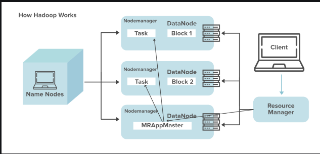

# Hadoop architecture
- Hadoop is an open-source framework developed in the Java programming language for distributed storage and processing of large amounts of data.

Hadoop is made up of three main components:

- HDFS: Hadoop Distributed File System (HDFS), which is the storage unit
- MapReduce which is the processing unit
- Yet Another Ressorce Negociator (YARN) which is the ressource management unit.

## HDFS

HDFS is the storage unit of Hadoop, designed to store large amounts of data in a distributed way.

HDFS breaks down a large amount of data into several **blocks** of the same size, except possibly the last one, , with as size the remaining size. The size of a block, called the block size, is typically 128 MB or 256 MB but can be configured according to the need.

A certain number of copies of each block, called **replicas**, are made and distributed across computer units called **data nodes** or **slave nodes**. This is called **replication**, and the number of copies of each block is called the **replication factor**, commonly set to 3.

Replication makes HDFS ***fault-tolerant***: In case of an issue with a block of data, another replica of that block can be accessed.

The computer unit that breaks down the data and distributes the blocks to data nodes is called the **name node**, also known as the **master node**. It is responsible for the functioning of the slave nodes and also stores metadata.

The slaves are responsible for reading, writing, processing, and replication. They also send signals called heartbeats to the master to indicate their status.

## MapReduce

MapReduce the processing unit in Hadoop, designed to handle large-scale data processing tasks by breaking them down into smaller, more manageable tasks and executing them in parallel.

Originally pioneered by Google for analyzing search results, MapReduce has become a cornerstone of distributed computing frameworks like Hadoop.

The MapReduce process follows these key steps:

- Decomposition of a large data into smaller data, called chunks
- Assignment/Distribution of these chunks accrosss servers.
-The processing of the data by each server: During that step, each server takes as argument the assigned chunk, processeses it and return a set of dictionaries.
-Gathering and Shuffle of the chunks from all servers
-Sorting the chunks by key
-Get a set of dictionories by aggregating the chunks with the same keys
-Return the final output

## YARN

YARN stands for Yet Another Resource Negociator and is the ressource management unit of Hadoop.

It acts like an OS:

- Assure that any server is overloaded
- Schedule tasks to assure tasks are scheduled at the right place.

Client requests are sent to the ressource manager which determines and assign the job to the right server(s). Then, the app master requests the container, which is a collection of resources incluginng RAN, CPU, hard drive, via the Node manager.

See more on [https://www.geeksforgeeks.org/hadoop-daemons-and-their-features/](https://www.geeksforgeeks.org/hadoop-daemons-and-their-features/)

