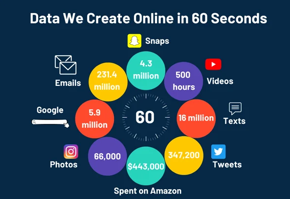
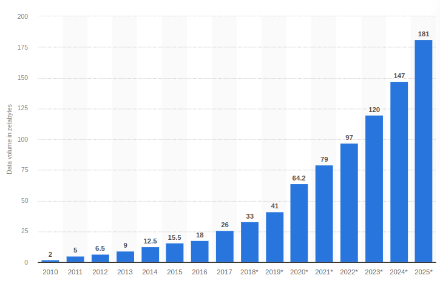

# Big data: Basics

## Motivation

**Per minute in 2024:**

- YouTubers upload 500 hours of videos.
- People send 16 million texts.
- Twitter users write 347,200 tweets.
- Snapchat users send 4.3 million snaps.
- Amazon shoppers spend $443,000.
- Instagram users make 66,000 posts
- Google users make 5.9 million searches.
- People send 231.4 millons of emaila
- Etc.

That is too much data stored on the internet per minute.

**Moreover**

- There are over 9 billion mobile phone users.
- There are 4.5 billion users on the internet.
- Etc.

All that reaches 2.5 quintillion (more than 2 millions TB)bytes of data generated every day.

[Source:g2](https://www.g2.com/articles/big-data-statistics)

And this data generation continues to grow exponentially over time.

[Image source: statista](https://www.statista.com/statistics/871513/worldwide-data-created/)

***Notes:*** 1 zettabyte is approximately equal to 1.07 billion terabytes

**Traditional databases' capability is limited:**

- While traditional databases can handle terabytes to petabytes of data, their responsiveness decreases with larger datasets.
- However, storing and efficiently processing such vast amounts of data exceeds traditional database capabilities.
  
This is where powerful tools like big data technologies come into play, enabling the storage and processing of immense datasets efficiently.

## Definition and characteristics

Big data consists of large amounts of data characterized by 5 Vs:

- **Velocity**: The speed of the data stream is incredibly fast.
  
- **Variety**: The data comes from various sources and has different structures.
  
- **Volume**: It involves handling a massive amount of data.
  
- **Veracity**: The quality and originality of the data are crucial.
  
- **Value**: Extracting value, whether it's profit, social, or medical benefits, from the data.

## Big data applications

There are several application fields of big data:

- **Media and Entertainment**:
  - Movie and video recommendations by platforms like Netflix and YouTube.
  - Improvement of online video game player experiences.

- **Insurance**:
  - Predicting illnesses and accidents for pricing.

- **Education**:
  - Utilizing big data-powered technology to improve student learning.
  
- **Healthcare**:
  - Disease prevention.
  - Personalized medicine.

- **Finance**:
  - Detection of fraudulent transactions.
  
- **Search Quality Improvement**.
  
- **Security**:
  - Crime prediction.
  
- **Marketing**:
  - Advertisement targeting.
  
- **Etc**.

## Some big data tools:

- **Hadoop:**
  - Hadoop is an open-source framework developed in the Java programming language for distributed storage and processing of large amounts of data.

- **Hive:**
  - Hive is a data warehouse for data querying and analysis.

- **Spark:**
  - Spark is a framework for distributed complex data analytics.
